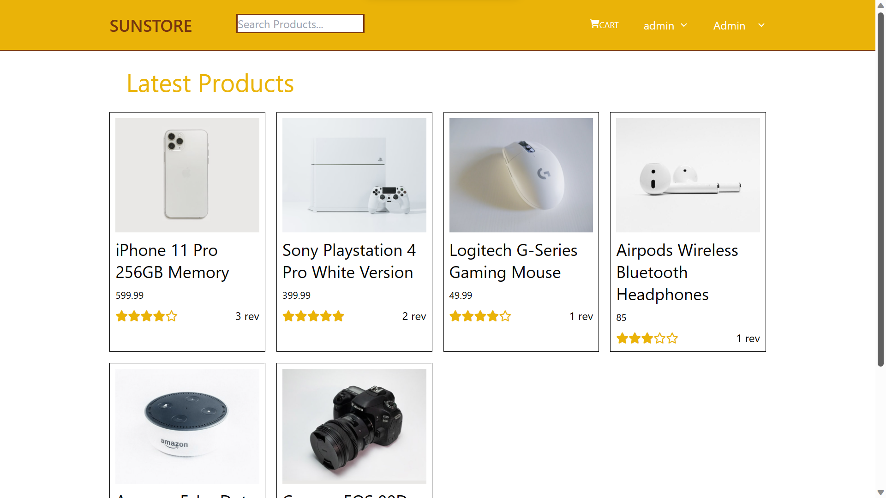

# SUNSTORE

  

<h3 align="center"> <a href="http://yukisunstore.s3-website-ap-northeast-1.amazonaws.com/"> SUNSTORE </a> </h3>

---

 こちらのイメージ写真をクリックして、ショッピングをお楽しみください:>
      

## 🧐 　紹介文 

こちら私の初の E-commerce サイトで Udemy に沿って作成しました。フルスタックのウェブサイトで、バックエンドは Node.js と Express を使用しプロダクト API、ユーザー API を作成しております。データベースは MongoDB よりデータを取得しています。フロンテンドは React と Tailwind にて開発し Reducer と state マネージメントを活用しています。
Register page にて新規登録した後、気に入った商品をカートに入れショッピングを楽しんで頂ければと思います。商品選択後は、支払いページ及び住所登録を行うことで完了致します。また、 Admin によるユーザー及びプロダクト管理が可能となっておりますので、そちらも確かめて頂きたいです。
それでは良いお買い物を。
